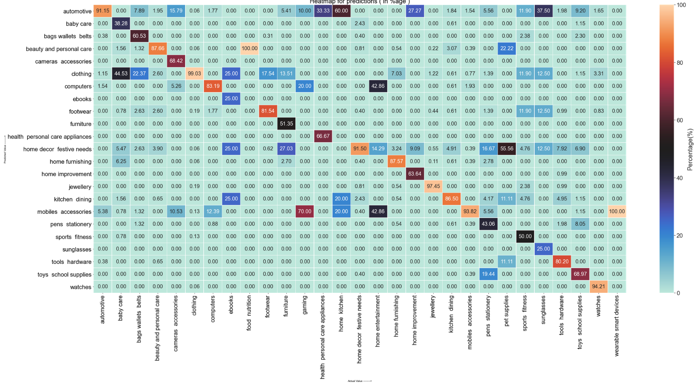
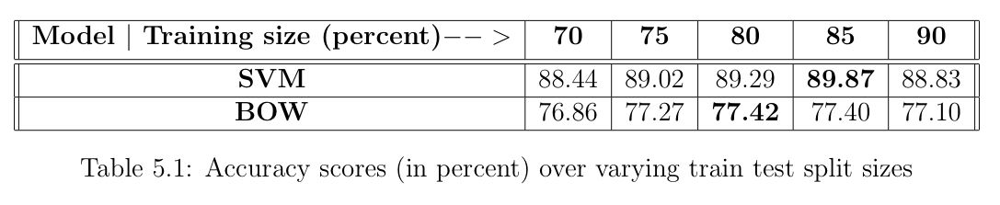

# E-COMMERCE COMMODITIES CLASSIFICATION

## Objective:
To predict the primary categories of E-commerce commodities primarily using their online descriptions. Use a given dataset to build a model to predict the category using description. Primary sub-tasks include:  
 
•Data cleaning and processing 
•Data visualization 
•Accuracy computation of the models specified  
In addition to the fully implemented pipelines included in this repository, a few other partially implemented approaches have also been included in the 'partial_experiments' sub-directory.The 'dataset' sub-directory houses the daatset used in this project. 'pre_trained_vectors' sub-directory consists of the file used for obtaining feature representation for any given string. The links to obtaining these files have been specified below. All the outputs generated by the models are stored in the 'output_files' sub-directory.  

## Required Files

<b>Dataset</b>  ( store in the 'dataset' sub-directory ) 
  <b>LINK -------></b> https://docs.google.com/spreadsheets/d/1pLv0fNE4WHokpJHUIs-FTVnmI9STgog05e658qEON0I/edit?usp=sharing
    
<b>Pre-Trained Vectors File</b> ( store in the 'pre_trained_vectors' sub-directory ) 
  <b>LINK -------></b>  https://drive.google.com/file/d/1AVhiOw7uPLEN1zbjqVqwZNcBg2DzOpEF/view?usp=sharing
  
  
 ## NOTE
main.ipynb does not include the complete theoretical cell-wise details of the methods it uses. Please refer to the respective notebooks in the directory to know the cell-wise implementation explanation. Thank You :)  

# CHAPTER-1 OVERVIEW

## 1.1 IMPLEMENTATION PIPELINE
In order to converge towards appreciable classification results for the given dataset, a total of fiveapproaches were attempted, with only two being fully implemented in this work.  These fully implemented approaches are as follows:  
•<b>Support Vector Machines (SVM) based approach</b>: It uses the SVC class of the SVM supervisedlearning method in order to classify test set records. 
•<b>Bag of Words (BOW) approach</b>:  It is based on the notion of creating a set of words for eachpossible category and then predicting labels using the description word count in each of thesebag of words. 

The  flow  diagram  above  briefs  the  implementation  pipeline  for  the  undertaken  sets of approaches.  As can be observed, the initial stages are shared by both the approaches.  They diverge when each model splits the dataset into training and testing subsets.

## 1.2 RELEVANT QUESTIONS
<b>How to clean and process the data?</b>
 Stages S0 through S3 of the implementation pipeline describe the procedure of cleaning and pro-cessing the given data  
<b>How to visualize the data?</b>
 The distribution of the records can be observed in the barplot below.  From the figure it can be observed  that  majority  of  the  records  reside  in  either  the  ’jewellery’  or  ’clothing’  category,  and categories such as ’automation robotics’, ’food nutrition’ etc.  have negligible record counts  
<b>How to measure the accuracy of the model?</b>
 The  accuracy  of  the  models  have  been  computed  using precision,recalland  the  method  of computing the overall percentage of correctly predicted records, i.e   Accuracy= (Number of correctly predicted records / Total number of records) * 100  Though precision and recall are highly used in multi-label classification tasks, both the approaches observed a lot of variation in their scores as compared to the corresponding percentage scores due to the following reason:  
•Not  every  label  present  in  the  test  set  was  present  in  the  set  of  predicted  labels.   This  is probably  due  to  inclusion  of  all  the  least  frequently  occurring  labels  in  the  test  set,  thus rendering the model incapable of predicting them  
•Due to presence of some labels having very few records in the entire dataset, the model wasnot able to learn appropriately about such records,  and thus misclassifying them.  
Thus, a more robust heuristic can be deployed in order to avoid the above stated problems. Strengthening  the  accuracies  of  the  dominant  labels  strongly favors the overall model performance as these labels are reflective of the entire dataset.

# CHAPTER-2 DATA CLEANING AND PROCESSING

## 2.1 FEATURE SELECTION
 The original dataset instance includes 20,000 records and 15 fields.  The feature extraction operation chooses a subset of these fields while keeping all the records.  The description field of the dataset is an implicit component of this subset along with a few other fields.  Any attribute that seemed to be of some utility in the later stages of the pipeline was not dropped, though not all ofthese fields were utilized in the pipeline displayed previously.  The following subset of five fields is returned bythe used feature selection method:  [’product name’ , ’product category tree’ , ’pid’ , ’description’ , ’brand’]  Miscellaneous attributes such as product ratings, unique id, crawl timestamp, price etc.  are irrelevant for predicting the category for any given product, and were thus discarded from the dataset   
## 2.2 RETRIEVING PRIMARY CATEGORIES
By splitting the category tree string on′ >> ′returned the hierarchy of categories each record is enlisted into.  The first entry in this list refers to the primary category for that particular item. Thus, only these values were retained for future use, dropping the rest of the category tree from further consideration.  Highest count for any category is of ’clothing’ with more than 6000 records.On the other hand, there existed highly specific categories with only single records in the entiredataset (eg. libas printed womens anarkali kurta) . Such records had a single level product categorytree and thus were immediately discarded from further consideration.  Some categories with morethan a single level of categorization and with only a handful of records ( eg.  ebooks ) have stillbeen considered for subsequent steps.  
## 2.3 PREPROCESSING
 The overall task of preprocessing primarily involves the product description.  For each record in theupdated dataset instance (obtained after feature selection and updating the category attribute),the description text goes through a series of standard NLP preprocessing modules, followed by acustom word set removal module.  

Though the product description goes through an extensive sequence of preprocessing steps,  the product brand, on the contrary, is simply converted to lowercase. The brand name then contributes towards the creation of the set of custom words, i.e.  a set of words which though occur in the description, and surpass the entire preprocessing timeline, but still do not contribute towards the task of classifying the product.  Examples of such words include ’sale’, ’delivery’,’guarantee’,’warranty’etc.   Similarily,  having  a  brand  name  in  the  product  description,  in  no  way,  aids  in  identifying its  category.   Though  there  might  be  certain  brands  in  the  given  dataset  that  are  limited  to  asubset of categories only, it cannot be implied that such brands would not be adding products intoother categories in the future.  One of the ways to improve the current preprocessing pipeline is to curate an extensive list of such custom words.  Since the current implementation consists of words identified through manual inspection, designing such a set primarily for this purpose can furtherhelp to filter out unnecessary words from the description.  

# CHAPTER-3 SVM MODEL
 The Support Vector Machines (SVM) model defined for classifying products incorporates the useof pre-trained vectors in order to define the attributes for each record in the dataset.  These pre-trained vectors are the embeddings for the record descriptions and their dimension denotes thenumber of attributes of each record.  These values are then passed onto the SVC class of SVMsupervised learning method to perform multi-class classification.  

## 3.1 HOW ARE INPUT ATTRIBUTES PREPARED?
  he  input  to  SVM  is  prepared  using  only  the  product  descriptions.   In  order  to  prepare  this input, a pre-trained vectors file ’glove.6B.50d.txt’ was used to obatin the feature representations.  ’glove.6B.50d.txt’, as the name implies, is a file with 50-dimensional word embeddings for 6B tokens obtained using GLoVe unsupervised learningalgorithm. Since  each  product  description  comprises  of  at  least  2  words  almost  all  the  time,  the  approach chosen to obtain a single 50-dimesnional feature representation for the entire phrase was to compute average of the embeddings over all the words in the descripton.The approach taken in such scenarioshas been defined in Algorithm 1.The reason for choosing SVM for this task was its efficiency in high-dimensional spaces and their capability to support both dense and sparse vectors as input.  Higher dimensionality embeddings can be utilized in such scenarios using pre-trained language models such as BERT.  

# CHAPTER-4 BAG-OF-WORDS (BOW) MODEL
 The BOW model, as the name suggests, involves making discrete sets of words from a portion ofthe given dataset record descriptions and use these sets to predict the categories for the recorddescriptions  of  the  remainder  of  the  dataset.   The  approach  though  involves  no  secret  sauce  ofstate-of-the-art machine learning methods, yet holds the potential to perform multi-label classi-fication given the circumstances of good amount of data.  

This model performs well for categories with a appreciable number of records.  The less frequently occurring records, on the other hand, face problems in classification due to lack of size of their corresponding bag of words. One of the better circumstances to use such a model is when there is an even distribution of labels among the records giving each bag-of-word an approximately fair share of words for prediction.  

# CHAPTER-5 VISUALIZING THE RESULTS

The Level-1 visualization briefs the superficial results without any information of label-wise classification results. The results at this level include the accuracy scores ( (no. of correctly predicted) / ( total test set records) and precision and recall) along with a simple pie chart visualization of these prediction counts. 

  In order to gain insights relevant to label-wise prediction counts and performance, the Level-2 visualization represents the results using a grouped bar graph with the number of correctly predicted labels and misclassified labels for each possible label value. Though the visualization of this level is bit non-uniform due the uneven distribution of records, it at the least provides a notion of the distribution of records into the possible label values.  

  A comprehensive analysis of the classifications can be obtained at this level using the heatmap visualization of the results. Such a representation offers the capability to compare the prediction results between any possible combination of label pairs. The heatmap results have been displayed in percentage format to reduce the high variance in classification values.  
  
In order to observe the trends in SVM and BOW model performances,  their respective accuracies,precision and recall were recorded over multiple train-test split sizes.  The results for precisionand recall were not recorded as stated in section 1.2.  As can be observed from the results in the table below, the accuracy scores do not exhibit a monotonous increase or decrease in values, instead,for training set of 90 percent, both the models experience a reduction in their test set accuracies.The potential reason for the bag of words to not perform well with increase in train set size is dueto addition of new records majorly from the dominant label (i.e.  clothing),  thus increasing thesize of that bag of words and reducing the probability of classifying other labels correctly.  Over-all, the SVM model performs far better than BOW model across all the train-test size splits.  The BOW model can potentially perform better in a dataset with a more evenly distributed set of labels.  
  

# CHAPTER-6 PARTIALLY IMPLEMENTED APPROACHES
## 6.1 Keyword Extraction using NER annotators
This approach initially seemed to be much more promising than BOW as Named Entity Recognition (NER) annotators, unlike the former, do not extract every preprocessed token as a keyword,thus maintaining a record of only relevant and important keywords.  The primary objective of thisapproach was to create a bag of words but with the NER keywords constituting them.  Experimentswith 18-class annotator of STANZA (a Stanford product) identified only CARDINAL labelsin the text, which by themselves are not sufficient for the task of category classification.  Other equivalent NER models include Flair and Spark from JohnSnow Labs. Design of a dedicated NER model for ecommerce products can help in identifying relevant key-words, thus keeping the set of words to a minimum as compared to the bag of words approach.  
## 6.2 Keyword Extraction using POS tagging
Inspired by the previous approach of making bag of words, this implementation aimed at creatingbags of words using tokens of specific set POS labels as the constituents.  The initial iteration ofthis approach was done used the 35-label nltk POS Tagger.  A few of the labels shortlisted were the subsets of verbs and nouns, but upon manual inspection, these subsets seemed to also includesome highly irrelevant set of keywords.  A proper examination of the identification pattern of the POS taggers can aid in shortlisting the important labels and thus improving the current Bag of Words approach.  
## 6.3 Classification using Similarity Computation
his  approach  aimed  to  classify records based on their semantic similarities between the description and the possible label values. In addition to computing GLoVe based embeddings for descriptions, this approach also computed the same for all the primary categories identified in stage S2, followed by similarity computation using  Cosine  similarity  method.   One  of  the  major  drawbacks  of  this  approach  was  the  unfair preference for multiple word labels over the single worded, though more prominent labels of the dataset.  For instance, the label ’clothing’ was usually misclassified as ’beauty and personal care’or ’health personal care supplies’.Planning  a  proper  heuristic  or  this  approach  can  yield  promising  results.   Some  of  the  possiblemeans to achieve this are as follows:  
•Use proper heuristics to assign unbiased embeddings to primary categories.  
•Use weighted voting approach while assigning labels based on similarity scores.•Use the state-of-the-art pre-trained language models such as BERT for computing featurerepresentations.  
## 6.4 Alternatives for Text Processing
Since the current approach uses the standard libraries (nltk,re etc.)  for description preprocessing,there  remains  a  scope  to  experiment  with  other  potential  alternatives  for  these  tasks.   Some  ofthe examples include text cleaning and text normalization using SparkNLP, and POS tagging andtext normalization using STANZA.  

# CHAPTER-7 OTHER POTENTIAL ALGORITHMS TO EXPLORE
Following  are  the  algorithms  that  can  be  experimented  with  over  the  given  dataset  in  order  to obtain potentially much more promising results:  
•Utilizing the images for each record in decision making can potentially improve the overallresults of the classifier, as images further add to the knowledge obtained from the textual descriptions.  Since none of the previously stated methods utilize images in their pipeline,doing so using a cohesive neural architecture may yield promising results.  
•Using pre-trained language models for the mainstream tasks of computing feature representations can help in better grasping the context of the description.  Several variants of BERTcan be experimented with in order to obtain better feature representations of the categories as well as the descriptions.  One of the major drawbacks of this approach is the increased duration of computation.  
•Creating an ensemble of various SVC input kernels and using voting procedure to predict the  category  for  a  test  set  record,  given  the  availability  of  the  necessary  computational bandwidth.  

# BIBLIOGRAPHY
F.  Pedregosa,  G.  Varoquaux,  A.  Gramfort,  V.  Michel,  B.  Thirion,  O.  Grisel,  M.  Blondel,P. Prettenhofer, R. Weiss, V. Dubourg, J. Vanderplas, A. Passos, D. Cournapeau, M. Brucher,M. Perrot, and E. Duchesnay.  Scikit-learn:  Machine learning in Python.Journal of MachineLearning Research, 12:2825–2830, 2011.  
Jeffrey Pennington, Richard Socher, and Christopher D. Manning.  Glove:  Global vectors forword representation.  In Empirical Methods in Natural Language Processing (EMNLP), pages1532–1543, 2014.  
Jacob Devlin, Ming-Wei Chang, Kenton Lee, and Kristina Toutanova.  BERT: pre-training ofdeep bidirectional transformers for language understanding.CoRR, abs/1810.04805, 2018.  
Peng Qi, Yuhao Zhang, Yuhui Zhang, Jason Bolton, and Christopher D. Manning.  Stanza:  APython natural language processing toolkit for many human languages.  InProceedings of the58th Annual Meeting of the Association for Computational Linguistics: System Demonstra-tions, 2020.  JohnSnowLabs.Sparknlpfromjohnsnowlabs.https://nlp.johnsnowlabs.com/docs/en/annotators.
